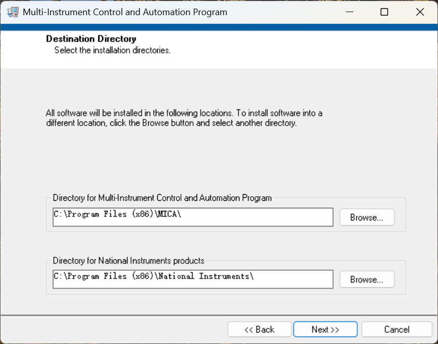
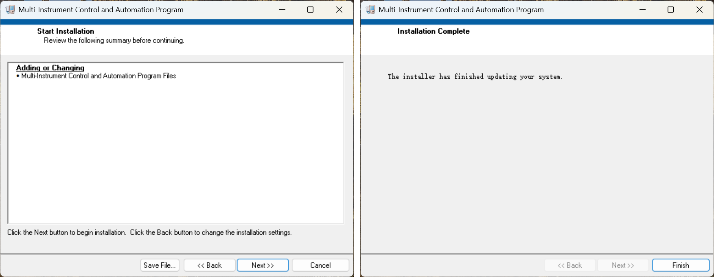
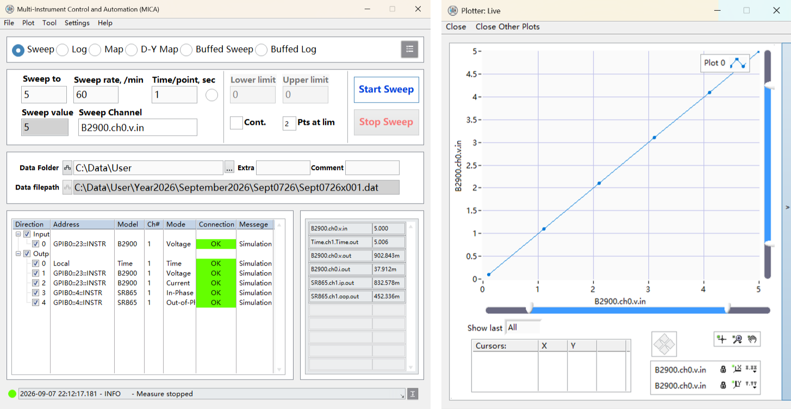
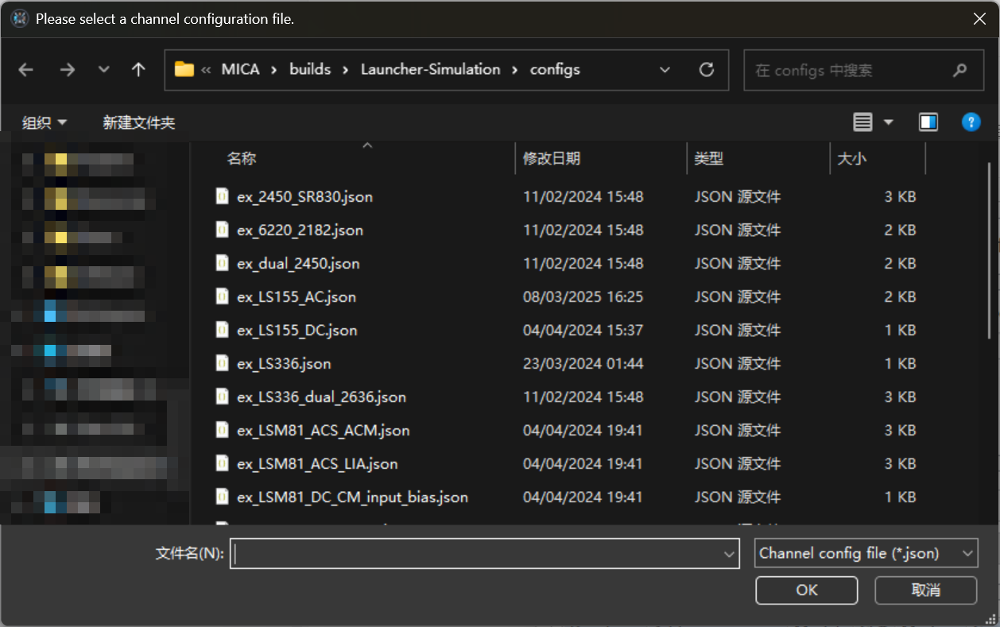
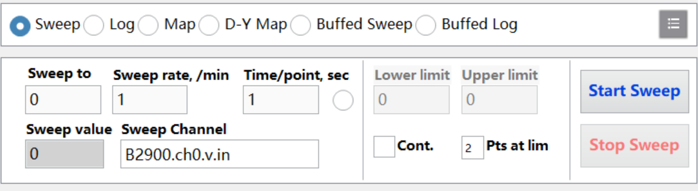
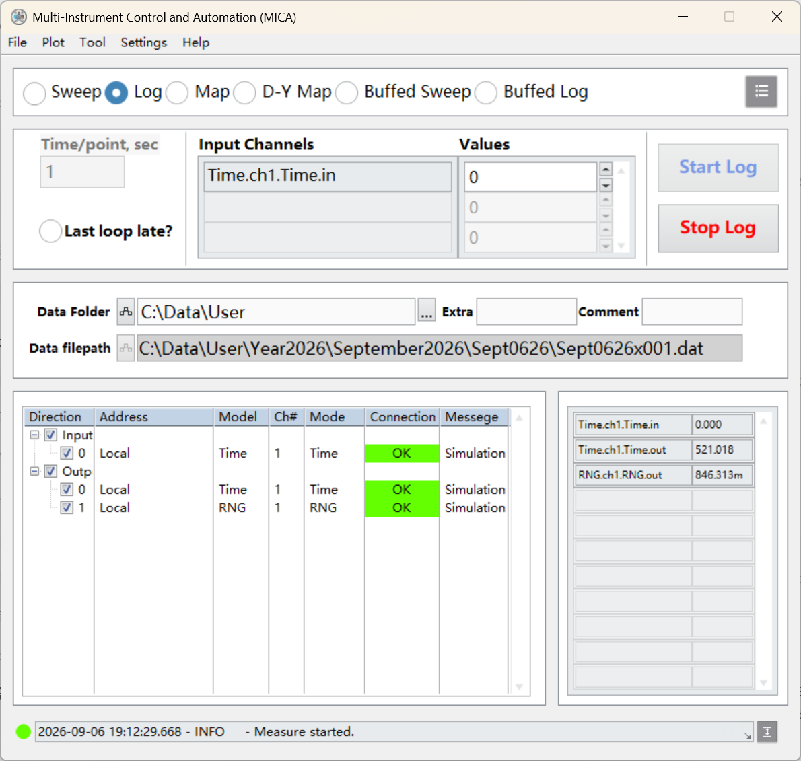
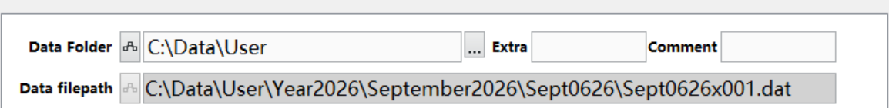

# Getting Started with MICA

MICA (Multi-Instrument Control and Automation) is a Windows application that operates several
laboratory instruments from a single interface. This guide is the shortest usable path from zero to
a first measurement: it covers what MICA is, how to install it, how to launch it, and how to run a
first measurement in simulation mode with no hardware attached. Everything reference-grade - the
full menu semantics, all four measurement modes, the channel-configuration schema, data-file
formats and troubleshooting - lives in the [user manual](user-manual.md).

All UI screenshots in this guide were captured in Simulation mode (no hardware attached); each
figure caption repeats that annotation.

## 1. What is MICA

MICA controls multiple lab instruments from one window for optoelectronics-style test scenarios: it
writes setpoints (voltage, current, frequency, amplitude, temperature, magnetic field, wavelength),
reads instrument outputs for monitoring, records readings together with their conditions and
timestamps in one unified data format, and visualizes results in real time. It is aimed at stable
devices and well-defined, repeatable procedures - device electrical characterization,
temperature- or magnetic-field-dependence sweeps, photoresponse testing, and multi-parameter linked
observation. Reusable configurations keep data formats consistent and reduce operator-to-operator
variance.

The central concept is the **channel configuration**: a small JSON file that declares the
instrument channels (address, model, physical channel, quantity, parameters). The config decides
which channels the main window shows and which quantities a measurement reads and writes - changing
experiment system means changing the config file, not the program.

The fastest way to learn the application is its **simulation mode**: readings come from local
random-number and time channels, no instrument protocol is exercised, and the UI, recording and
plotting behave exactly as they do online. Simulation is a first-class architectural feature (the
driver layer ships Raw/Sim operation pairs and can hot-switch between real and simulated
instruments) - see [architecture.md](architecture.md).

(source: manual-extraction §1, L17-37 and L114-122; wave1-findings §7.10)

## 2. Prerequisites

- A Windows PC.
- **Real instruments only:** the VISA communication environment and the GPIB/USB/serial/Ethernet
  links must be configured and wired **before** installing MICA. VISA addresses look like
  `GPIB0::22::INSTR` (interface type, address number, session attributes) - record each instrument's
  address while wiring it.
- **No separate driver installation** is needed on the MICA side; drivers ship inside the software
  directory. Before building a system, check that your instruments are within the supported set -
  see the code-adjudicated supported-instrument table in [user-manual.md](user-manual.md).
- **A writable data directory.** MICA writes one data file per measurement; if the current user
  cannot write to the data folder, data files will not be created.

When going online later, confirm before measuring: instrument power, cable seating, VISA
driver/interface match, each VISA address reachable, and config addresses matching the wiring. The
full online-readiness checklist is in [user-manual.md](user-manual.md).

(source: manual-extraction §2, L167-181 and L220)

## 3. Obtain and install

Releases are published on the project's GitHub repository `mica-home/MICA`, on its
[Releases page](https://github.com/mica-home/MICA/releases), listed per version with release notes.
Four delivery forms exist:

- **Installer** (recommended) - one-click deployment of the MICA program plus the required NI
  runtime components.
- **Prebuilt release directory** - a complete directory containing `Launcher.exe`, `Launcher.ini`,
  a channel-config directory and a program-library directory; keep the relative layout when copying.
- **Simulation build** - the same files with the simulation switch already on.
- **Independent updater** - ships alongside the releases and performs program updates.

To install, run the installer wizard. The destination page lets you set separate install locations
for the MICA program and the NI product components; the confirmation page lists everything that
will be installed. After copying, launch MICA from the Start menu or from the install directory.
The wizard's default destination is recommended - avoid special characters in custom paths. After
installing, verify that the program, config and data directories are accessible, and make the first
run a simulation run.

*Figure 1. The installer's destination page, where separate install locations can be set for the
MICA program and the NI components - captured in Simulation mode (no hardware attached).*

*Figure 2. The installer's confirmation page (items to be installed) and completion page -
captured in Simulation mode (no hardware attached).*

(source: manual-extraction §2, L183-221; wave1-findings §4)

## 4. First launch

Close any programs that may hold instrument interfaces, then start `Launcher.exe`. A splash screen
appears while the application loads its actor and driver registries (the same startup screen is
shown in [architecture.md](architecture.md)), and then the main window opens with initialization
messages appearing in the log bar at the bottom.

Confirm that all five areas rendered: the **measurement panel** (mode selection and parameters),
the **record panel** (data folder and file path), the **config panel** (channel table), the **data
panel** (live values) and the **log bar**, plus the error-indicator LED in the status bar.

First-run settings live in the **Settings** menu: `Simulation` (replace instrument readings with
simulated values), `Load after Start` (pop the config file-selection dialog at startup) and
`Debug log` (verbose log output). They are stored in the launcher INI file (`[Settings]` keys
`Simulation`, `Load after Start`, `Debug Log`) and are applied at the next launch. For a first run,
leave Simulation on.

*Figure 3. The MICA main window with a Plotter window beside it; the config panel shows the loaded
channel table and the log bar shows initialization and measurement messages - captured in
Simulation mode (no hardware attached).*

(source: manual-extraction §2, L223-244; §3, L232-236; conflict register C9)

## 5. Interface orientation

The main window is organized top-to-bottom as: menu bar (File, Plot, Tool, Settings, Help),
measurement panel (mode selection + parameters + start/stop), record panel (data folder + live
data-file path), config panel (channel table with connection states), data panel (current values of
all channels), and the log bar. Plots open in a separate window titled "Plotter: Live", and several
plotter windows can be open at once. The layout follows "control first, then record, then observe".

This guide stops at identification. What each menu item does, the per-mode parameter sets and the
plotter's toolbar are covered in the [user manual](user-manual.md) - start with its "UI tour"
section. Figure 3 above doubles as the annotated overview: measurement controls in the upper area,
recording and configuration beneath them, live values and log messages at the bottom, and the
plotter window showing the curve.

(source: manual-extraction §3, L247-267 and L351-396; conflict register C10)

## 6. First measurement in Simulation mode

One fixed recipe, in this order:

1. **Enable simulation** - Settings → `Simulation` (skip this if you installed the simulation
   build, which starts with it on). Optionally enable `Load after Start` if you want the config
   file dialog to appear at every launch.
2. **Load a sample config** - File → Load Config and pick `configs/config_time_rng.json`, which
   ships with the software: one local `Time` input channel and two output channels (`Time` and
   `RNG`), all with `address` `Local` - no instrument addresses involved.
3. **Pick a mode and set modest parameters.** With the Sweep mode selected, choose the channel to
   sweep from the Sweep Channel selector (with this config the candidates are the local Time and
   RNG channels), set a target value and a slow rate, and give each point a short settle time.
   Log mode is the even simpler alternative: press Start Log and watch values accumulate at the
   record interval.
4. **Start, then stop.** The software advances the swept channel at the set rate and records all
   enabled channels at each settled point. Stop when you have enough points.

*Figure 4. File → Load Config opens the channel-configuration file dialog - captured in Simulation
mode (no hardware attached).*

*Figure 5. The Sweep mode panel: sweep channel, target, rate, per-point settle time and limits -
captured in Simulation mode (no hardware attached).*

While it runs, watch three places: the **data panel** lists the current value of every channel, the
**log bar** records entries such as "Measure started.", and Plot → New Plot opens a "Plotter: Live"
window that draws the curve as points arrive.

*Figure 6. A simulation measurement in progress on the `config_time_rng.json` sample: live values
in the data panel and the measurement started in the log bar - captured in Simulation mode (no
hardware attached).*

*Figure 7. The log bar at the bottom of the main window, with the status LED green and an INFO
entry confirming the measurement started - captured in Simulation mode (no hardware attached).*

Sanity note: simulation readings are random numbers. They prove that the flow - config load,
measurement, recording, plotting - works, and nothing about physics.

(source: manual-extraction §6.1, L723-748; §4.1, L483-494; §5.1, L593-599; sample config
`configs/config_time_rng.json` verified programmatically)

## 7. Where your data goes

The default data root is `C:\Data\User` (a software default, persisted in the launcher INI file
under `[Logger] Data Folder Path`). On every measurement start, MICA builds a date directory under
the root - a year level, a month level, then a day level - and writes the measurement file inside
it, named `<MonDDyy>x<NNN>.dat`. A run started on January 7, 2026, for example, produces a file
like `Jan0726x020.dat`; the three-digit serial auto-increments within the day directory. One
measurement equals one file, and the directories are created automatically.

The record panel's **data file path** indicator shows the live target file for the current or last
run (Figure 8). The record panel remembers the last data path across restarts - re-verify it before
measuring. To look at a file again later, use Plot → New Plot from File; historical plots offer the
same interactions as live ones.

*Figure 8. The record panel close-up: data folder setting and the live data-file-path indicator -
captured in Simulation mode (no hardware attached).*

The full directory hierarchy, the file content format (frames, columns, header) and a date-offset
caveat near midnight are described in [user-manual.md](user-manual.md), section "Data files &
results".

(source: manual-extraction §7.1, L828-853 and L879-882; conflict registers C7, C8)

## 8. Next steps

- **Read the full documentation.** The [user manual](user-manual.md) is the complete reference;
  [architecture.md](architecture.md) and the module pages ([cores](modules/cores.md),
  [drivers](modules/drivers.md), [panels](modules/panels.md), [tooling](modules/tooling.md))
  describe the internals.
- **Follow the validation ladder before real hardware:** simulation → configuration → online. Each
  layer peels one class of problems apart so they are not co-debugged - and remember that
  simulation never exercises instrument communication. The full workflow is in the user manual's
  "Notes & limitations" section.
- **Adapt a worked example.** Two worked systems ship as sample configs: a photoresponse test
  system (sourcemeter + lock-in + power meter) and a multi-physics measurement system (temperature
  controller + two sourcemeters). Both are walked through, with their config JSON, in the user
  manual's "Worked examples" section.
- **Maintenance.** Updates are checked from Help → Check for Updates; see the user manual's
  "Maintenance & update" section for the update workflow and the pre-update checklist.

(source: manual-extraction §9, L972-1038; §6.2-6.3, L750-821; §10.1, L1044-1056)
