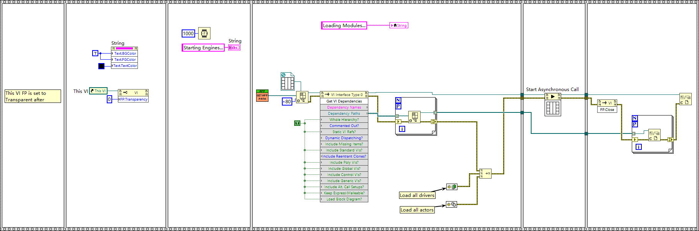

# app — Application root actor and entry point

- **Main class:** `app/App/App.lvclass` (`App.lvlib:App.lvclass`), inheriting the vi.lib MGI `Panel Actor` base class. App is the top panel actor of the whole system.
- **Entry VI:** `app/Launch App.vi` — the process entry point; it builds the App actor object and launches it as the root panel actor.

Module size: 39 files (30 `.vi`, 7 `.lvclass`, 1 `.lvlib` = `app/App.lvlib`, 1 `.ctl`), including 6 message classes.

## App actor in one paragraph

App owns the application's top-level concerns: it keeps the registry of GUI refnums, runs menu handling,
forwards the channel configuration to the manager, switches the active measurement core, and drives
application logging. Its private data carries five fields: `LoopEvent` and `Logging Event` (user events),
`App Config` (an AppConfig class instance from `utility/`), `Manager's Enqueuer`, and `GUI_Refnums` —
the latter is bound to the typedef `app/App/GUI Refnums.ctl`, a cluster of nine refnums (Actor Core,
Core Selection Panel, Core Panel, DataLogger Panel, ConfigViewer Panel, DataTipper Panel, HistoryLogger
Panel, QuickAccessBar Panel, Menu). Through this one cluster the App actor can re-target every major
front panel of the application.

## Members of App.lvclass

`Actor Core.vi`, `Create.vi`, `Destroy.vi`, `Handle Error.vi`, `Handle Menu.vi`, `Init GUI.vi`,
`Init Logging.vi`, `Init Menu.vi`, `Load App Config.vi`, `Load Channel Config.vi`,
`Pre Launch Init.vi`, `Re-init Driver.vi`, `Set Logging Debug Level.vi`, `Stop Core.vi`,
`Switch Core.vi`, `Update Layout.vi`. Two further VIs sit at the `app/` top level:
`app/Get App Path.vi` (path resolution for the built executable) and `app/Launch App.vi`.

## Launch App.vi — how the process starts

`app/Launch App.vi` has no controls or indicators; it is a two-node chain:

1. Constants: an `App.lvclass` object plus `Default Title = "Multi-Instrument Control and Automation (MICA)"`,
   `Maximize? = false`, `Autoshow? = true`.
2. A dynamic-dispatch call to the MGI `Panel.lvlib:Panel Type Selector.vi` (instance
   `Window.lvclass:Window Top Level.vi`) produces the top-level window.
3. A call to `Panel Actor.lvclass:Launch Root Panel.vi` starts the App actor's message loop.

## Splash-Screen.vi — asynchronous preloading

`Splash-Screen.vi` at the repository root is the top-level source of all three Launcher EXE build
specifications (Launcher-Debug, Launcher-Release, Launcher-Simulation). While the splash is visible it
invokes `Load all actors` (`cores/load_actors.vi`) and `Load all drivers` (`drivers/load_drivers.vi`)
as strict VI references under `Start Asynchronous Call`, arranged in a flat sequence with a for-loop —
both registries are preloaded while the splash is shown. It resolves its own location through
`app/Get App Path.vi`, inspects VI dependencies, then makes its own front panel transparent and closes.
One caveat kept from the source analysis: the literal name "Launch App" does not appear in the
Splash-Screen diagram export; its place in the chain follows from the build manifest, which includes
`App.lvlib/Launch App.vi` in every Launcher specification.

Splash screen shown at startup while the actor and driver registries are preloaded asynchronously.

## Startup chain, assembled

Launcher-&lt;variant&gt; executable (built from `Splash-Screen.vi`, bound to its ini in `inifiles/`)
→ `Splash-Screen.vi` → path resolution (`app/Get App Path.vi`) plus asynchronous preloading of
`cores/load_actors.vi` and `drivers/load_drivers.vi` → `app/Launch App.vi` (per the build manifest)
→ the App actor runs as root panel actor and drives the manager (see `docs/modules/manager.md`).

## App message classes (6)

`Handle Menu`, `Init GUI`, `Load Channel Config`, `Re-init Driver`, `Switch Core`, `Update Layout`.
Each follows the Actor Framework triplet convention: a `<Name> Msg.lvclass`, a public dynamic-dispatch
`Do.vi`, and a public static `Send <Name>.vi` enqueuer. The same lifecycle verbs that recur on the
manager and core tiers (re-init driver, switch core, update layout) already appear here — App, manager
and cores share one event vocabulary.

## Notes for readers

- App and the measurement Core are not siblings: Core reaches the MGI Panel Actor root through
  `panels/MicaSubpanel` (see `docs/modules/cores.md`).
- The `On hot sim switch` handling exists at the App tier as part of the cross-tier hot-simulation
  vocabulary, although the App message folder itself carries the six messages listed above.
- Documentation baseline: sources are the Wave 1/Wave 2 analysis artifacts under `.omz/tmp/lvmcp-docs/`
  (class hierarchy probes and VI deep reads); unprobed details are marked as such rather than guessed.
