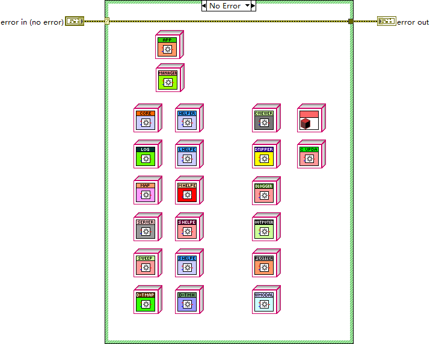

# cores — the measurement core family

- **Main class:** `cores/Core/Core/Core.lvclass` (`Core.lvlib:Core.lvclass`), inheriting
  `panels/MicaSubpanel` (`MicaSubpanel.lvlib:MicaSubpanel.lvclass`), which in turn inherits the vi.lib
  MGI `Panel Actor` base. The measurement core is a subpanel-embedded panel actor, not a direct sibling
  of the App actor.
- **Entry VIs:** `cores/load_actors.vi` — the registry of every actor class MICA can launch (referenced
  by `Splash-Screen.vi`, listed in the project tree under the manager virtual folder) — and
  `cores/Core/Core/Actor Core.vi`, the base core's startup VI.

Module size: 161 files (116 `.vi`, 29 `.lvclass`, 12 `.lvlib`, 4 `.ctl`), organized as exactly twelve
libraries: six cores (Core, Log, Map, Server, Sweep, D-Y Map) and six helper actors (Helper, Log Helper,
Map Helper, Server Helper, Sweep Helper, D-Y Map Helper).

## The shared core template

Core, Map, Sweep (and D-Y Map by file symmetry) follow one measured pattern in their `Actor Core.vi`:

1. Collect the front-panel controls into VI Server references and bundle them into the `GUI_refnums`
   typedef cluster.
2. Disable the Start/Stop buttons (disabled *and* grayed out).
3. Create the `Stop GUI Loop?` user event and register for events.
4. Read the caller's enqueuer, then configure the helper actor: `Write Managers's Enqueuer.vi` and
   `Write GUI_refnums.vi` on the helper class, then `Launch Nested Actor.vi`.
5. Hand the helper's enqueuer back to the core (`Write Helper's Enqueuer.vi`) and call the parent class
   method, which enters the MGI panel-actor event loop.

The Core UI state model is the three-value enum `uint16{init, idle, busy}`, pushed to the GUI through
`Set Core GUI State.vi`; Map and Sweep carry identically named overrides. The helper actors run the
actual measurement loop against the driver objects (see `docs/modules/drivers.md`); their loop internals
were not deep-read in this pass and are described only from their member and message inventories.

## The twelve libraries

### Core (`cores/Core/`)

The subpanel-embedded base measurement core. Three private fields: `Helper's Enqueuer`, `Channel Config`,
`Driver Ready?`; 23 members including `Init Drivers.vi`, `Close Drivers.vi`, `Measure.vi`,
`Pre-measure.vi`, `Post-measure.vi`, `Update Drivers.vi`, `Force-stop-measure.vi`,
`On hot sim switch.vi`, `On Enable Selection Changed.vi`, `Set Driver Ready.vi`, `Set Core GUI State.vi`,
and the channel accessors (`Read/Write Input.vi`, `Read/Write Output.vi`, `Read Enabled Channels*.vi`).
Ten message classes: `Close Drivers`, `Force-stop-measure`, `Init Drivers`, `Measure`,
`On Enable Selection Changed`, `On hot sim switch`, `Post-measure`, `Pre-measure`, `Set Driver Ready`,
`Update Drivers`. Note the deliberate cross-directory borrow: `MicaSubpanel` (panels) lists
`cores/Core/Core/Get Actor Core Size.vi` as its member.

### Helper (`cores/Helper/`)

The measurement-loop actor paired with the base Core. Inherits the MGI `Monitored Actor` root (the same
root as the manager). Five private fields including the `Start Measure Loop` and `Terminate Measure
Loop` notifiers, which is how the Core starts and aborts the loop. Five messages: `Force-stop-measure`,
`Measure Finished`, `Start Measure`, `Update Drivers`, `Update Period`; members include
`Write Period (s).vi` and the notifier read/write accessors.

### Log (`cores/Log/`)

A logging-oriented core variant. By file layout a Core child (not probed in the class pass): members
`Actor Core.vi`, `Force-stop-measure.vi`, `Pre-measure.vi`, `Read Actor Core Size.vi`,
`Set Core GUI State.vi`, `Update Drivers.vi`. It defines no message classes of its own.

### Log Helper (`cores/Log Helper/`)

Companion helper for the Log core. One message: `Update Input Values`. Members: `Actor Core.vi`,
`Update Drivers.vi`, `Update Input Values.vi`, `Write GUI_refnums.vi`, `Stop Core.vi`.

### Map (`cores/Map/`)

The 2D mapping core. Template-confirmed by a deep read of `cores/Map/Map/Actor Core.vi`: eleven GUI
controls (`Start Map`, `Stop Map`, `Lower limit`, `Upper limit`, `Last loop late?`, `X rate, /min`,
`Time/point, sec`, `Map Value`, `Y slices`, `Map Channels`, `Map Mode`) bundled into `GUI_refnums`;
launches the Map Helper nested actor and cross-wires enqueuers exactly as the template describes.
Its two typedefs are a known duplicate-content pair: `Map Config.ctl` and `Map Mode.ctl` are
byte-identical files carrying the same three-item "Map Mode" enum — the "Config" name is misleading.

### Map Helper (`cores/Map Helper/`)

Nested helper for Map. Members: `Actor Core.vi`, `Update Drivers.vi`, `Write GUI_refnums.vi`, and
`generate Map sequence.vi`, which builds the map scan sequence the helper executes.

### Server (`cores/Server/`)

The server-variant core — a probed direct child of Core with a single `GUI_refnums` field. It overrides
the driver-lifecycle hooks `Init Drivers.vi`, `Pre-measure.vi`, `Post-measure.vi` and
`Update Drivers.vi` while omitting the GUI-state plumbing the interactive cores carry.

### Server Helper (`cores/Server Helper/`)

Nested helper for Server. Members: `Actor Core.vi` and `Write GUI_refnums.vi` only — the smallest
helper.

### Sweep (`cores/Sweep/`)

The sweep core. Template-confirmed like Map, with twelve GUI references (`Sweep Channel`, `Start Sweep`,
`Sweep Stop`, `Lower limit`, `Upper limit`, `Cont.`, `Sweep to`, `Time/point, sec`, `Sweep rate, /min`,
`Sweep value`, `Last loop late?`, `Pts at lim`); the sweep parameters reach Sweep Helper's timing loop
through the `GUI_refnums` cluster. `cores/Sweep/Sweep Config.ctl` is the matching typedef cluster
(sweep target, rate, time per point, channel, continuous flag, limits, points-at-limit enum). Members
include its own `Measure.vi` override in addition to the standard overrides.

### Sweep Helper (`cores/Sweep Helper/`)

Nested helper for Sweep. Members: `Actor Core.vi`, `Update Drivers.vi`, `Write GUI_refnums.vi`. The
helper's loop internals were not deep-read in this pass.

### D-Y Map (`cores/D-Y Map/`)

The D/Y mapping core (measuring D as a function of Y — derivative versus bias — per its config cluster).
`cores/D-Y Map/D-Y Map Config.ctl` defines upper/lower D-Y limit clusters, D rate /min, time per point,
Y step, a three-channel cluster, and capacitance terms; its control label is "D-T Map Config", which
differs from the file name. Members: `Actor Core.vi`, `Pre-measure.vi`, `Set Core GUI State.vi`,
`Update Drivers.vi`, `Read Actor Core Size.vi`. Two cautions attach to this family:

- **Duplicate class file trap.** `cores/D-Y Map/D-Y Map.lvclass` and
  `cores/D-Y Map/D-Y Map/D-Y Map.lvclass` carry the *same qualified name*
  (`D-Y Map.lvlib:D-Y Map.lvclass`) and both inherit Core, but their private-data controls differ in
  size (10384 vs 10432 bytes, measured). Only the outer file is adopted by the `.lvlib`. Any
  cross-reference or generated catalog must disambiguate by full repository path, never by class name.
- **Internal name discrepancy (open item).** The constants inside `cores/load_actors.vi` read
  `D-Y Map.lvlib:D-T Map` and `D-Y Map Helper.lvlib:D-T Map Helper` while every file on disk is named
  "D-Y Map". Whether the internal class record says "D-T" or "D-Y" was not inspected in this pass; the
  discrepancy is recorded, not adjudicated.

### D-Y Map Helper (`cores/D-Y Map Helper/`)

Nested helper for D-Y Map. Members: `Actor Core.vi`, `Update Drivers.vi`, `Write GUI_refnums.vi`.

`cores/load_actors.vi` returning the class constants of every actor MICA can launch.

## Core-config typedefs (4)

`cores/D-Y Map/D-Y Map Config.ctl` (label "D-T Map Config"), `cores/Sweep/Sweep Config.ctl` (label
"Sweep Config"), and the duplicate pair `cores/Map/Map Config.ctl` == `cores/Map/Map Mode.ctl`
(both label "Map Mode"). All four are plain, bindable typedefs.

## Notes for readers

- The operator-facing semantics of the four measurement modes (Sweep, Log, Map, D-Y Map) and their
  front-panel parameters are documented in [user-manual.md](../user-manual.md), "Measurement modes".
- Cores are nested, never root: the manager launches them with `Launch as Nested Actor.vi`, and each
  core lands in the main window's subpanel through the MicaSubpanel host it inherits from.
- The same lifecycle verbs (`Pre-measure`, `Post-measure`, `Measure`, `Update Drivers`,
  `Force-stop-measure`, `On hot sim switch`, `Close Drivers`) recur across the App, manager, Core and
  Helper tiers — one cross-tier event vocabulary.
- Documentation baseline: Wave 1 class-hierarchy probes (Core, Helper, Server, D-Y Map probed; Log, Map,
  Sweep asserted by file layout), the Wave 2 deep reads of the Core/Map/Sweep Actor Cores, and the
  `load_actors.vi` extract, all under `.omz/tmp/lvmcp-docs/`.
