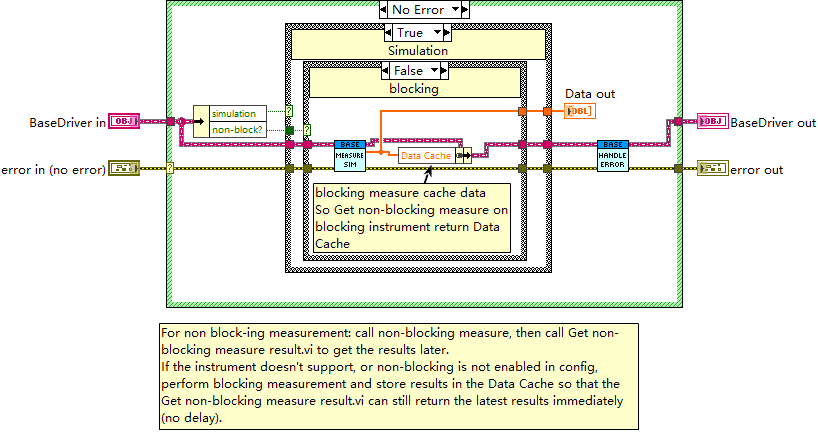
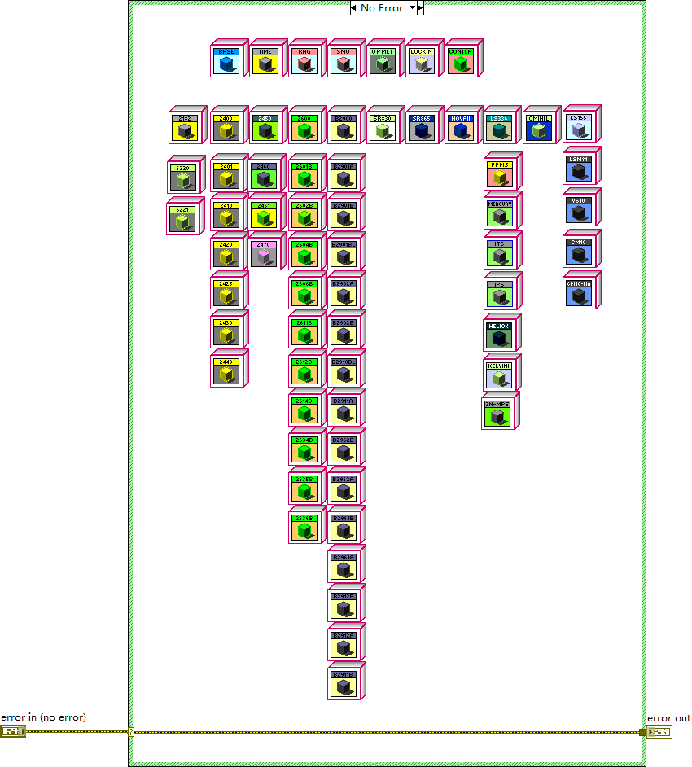

# drivers — instrument driver tier

- **Main class:** `drivers/Base/BaseDriver.lvclass` (`BaseDriver.lvclass`), the only repository-internal
  class root that derives directly from `LabVIEW Object`. Drivers are plain classes composed and called by
  the Core tier — they are deliberately *not* actors and have no message loop.
- **Entry VI:** `drivers/load_drivers.vi` — the driver class registry. Its "No Error" case builds an
  array of roughly 68 class constants (one per driver class), mirroring `cores/load_actors.vi`; the two
  registries are the static plugin tables of the application, preloaded asynchronously by
  `Splash-Screen.vi`.

Module size: 300 files (228 `.vi`, 65 `.lvclass`, 7 `.ctl`; the drivers tier defines no `.lvlib` of its
own), organized as sixteen instrument families under the shared `drivers/Base/`.

## BaseDriver — template methods and Raw/Sim split

`BaseDriver.lvclass` carries ten private fields: `address` (VISA instrument refnum), `channel` (i32),
`mode` (string), `<JSON>extra-parameters` (string), `direction` (u16), `non-block?` (boolean), `name`,
`short`, `simulation` (boolean), and `Data Cache` (array); 40 members. Every operation exists in a
Raw/Sim pair — `Init Driver`, `Measure`, `Source`, `Close Driver`, `Non-blocking Measure`,
`Check Connection` each have a `- Raw` and a `- Sim` variant — and the `simulation` field selects the
arm at runtime. Hot simulation switching is a first-class feature: dedicated `On hot sim switch`
messages exist at the App, manager and Core tiers.

### `drivers/Base/Measure.vi` — the template-method dispatcher

The single public measure entry every core-family actor calls. Three nested case structures dispatch on
error → `simulation` (Raw/Simulation) → `non-block?` (blocking/non-blocking) to one of four
dynamic-dispatch hooks: `Measure Raw.vi` / `Measure Sim.vi` (blocking) or `Non-blocking Measure Raw.vi` /
`Non-blocking Measure Sim.vi`. The contract, per the diagram comment: non-blocking measurements return
immediately with an empty array and deliver later via `Get non-blocking measure result.vi`; if an
instrument does not support that — or non-blocking is not enabled in config — the blocking hook runs and
its results are stored in `Data Cache`, so the same getter still returns the latest results immediately.
A fifth hook, `Handle Error.vi`, runs after every dispatch as the per-driver error policy. Subclasses
override only the Raw hooks; the Sim hooks give every driver a working simulation mode for free.

`drivers/Base/Measure.vi` dispatching to Raw/Sim and blocking/non-blocking hooks and caching the result.

### `drivers/Base/Query.vi` — the VISA primitive

Generic SCPI write-then-read on the driver's stored `address`: `VISA Write` (query string) →
`openg_time.lvlib:Wait (ms)` (OpenG library; default delay 1 ms) → `VISA Read` (default byte count 256)
→ `result` string. This is the only direct VISA usage observed on BaseDriver's public surface; richer
instrument I/O lives in vendor library VIs that open their own VISA sessions.

## Vendor library layer

Model hooks stay thin and delegate to per-instrument vendor libraries. Measured example:
`drivers/Keithley/2450/Source Raw.vi` reads the driver's address and mode, converts the generic mode
through `Convert mode for instrument.vi`, then calls `Keithley 2450.lvlib:Configure Source Level.vi` and
`Keithley 2450.lvlib:Enable Output.vi` — the vendor library owns the actual VISA traffic. The same
layering applies to the 2450's `Init Driver Raw.vi` and `Measure Raw.vi`.

## Family matrix (16 families, all with a real `.lvclass`)

Families are directories; inheritance edges may cross them (Keithley and Keysight models point at
`drivers/SourceMeter/`). All edges below come from class probes; anything not probed is marked
"not inspected in this pass". The user-facing supported-instrument and extra-parameter tables built
on this registry (code-adjudicated, with manual deltas annotated) are in
[user-manual.md](../user-manual.md), "Channel configuration reference".

| Family (directory) | Representative class | Inherits from | Notes |
|---|---|---|---|
| Base | `drivers/Base/BaseDriver.lvclass` | `LabVIEW Object` | Root of the tier; 10 fields, 40 members; Raw/Sim template methods; accessors, JSON parameter parsing, `to Config json.vi`. |
| SourceMeter | `drivers/SourceMeter/SourceMeter.lvclass` | BaseDriver | Middle layer; fields Autorange (u16), Autozero (u16), Compliance (f64); parent of the Keithley, Keysight B29xx and LakeShore LSM81 lines. |
| Keithley | `drivers/Keithley/2450/2450.lvclass` | SourceMeter | 26 model classes (2182, 2400, 2401, 2410, 2420, 2425, 2430, 2440, 2450, 2460, 2461, 2470, 2600, 2601B, 2602B, 2604B, 2606B, 2611B, 2612B, 2614B, 2634B, 2635B, 2636B, 4200, 6220, 6221) — catalog merged into this row rather than one section per model. Probed: 2400, 4200, 2470 (alias of 2450), 2601B (alias of 2600); the remaining models not inspected in this pass. |
| Keysight | `drivers/Keysight/B2900/B2900.lvclass` | SourceMeter | 15 B29xx model leaves (B2900 … B2962B); B2912B spot-checked as a 0-member alias of B2900; most leaves not inspected in this pass. |
| LakeShore | `drivers/LakeShore/LSM81/LSM81.lvclass` | SourceMeter | LSM81 line (LSM81 + three variants), plus LS155 and LS336 temperature controllers. LSM81 fields: `shape` and `amplitude type` typedefs plus `immediate`; LS155/LS336/variants not inspected in this pass. Per-model `Mode Type`/`shape type` typedefs (7 `.ctl`). |
| Lock-in Amplifier | `drivers/Lock-in Amplifier/Lock-in Amplifier.lvclass` | BaseDriver | Middle layer; Auto-phase / Auto-gain / Auto-reserve / Internal booleans. |
| SRS | `drivers/SRS/SR830/SR830.lvclass` | Lock-in Amplifier | SR830 probed (0 fields); SR865 not inspected in this pass. |
| Controller | `drivers/Controller/Controller.lvclass` | BaseDriver | Middle layer for temperature/magnet controllers; only decoded defaults of the pass: delay-second = 0, wait-stable = 0, wait-for-channel = 1; `Wait for stable.vi`. |
| Mercury | `drivers/Mercury/Mercury/Mercury.lvclass` | Controller | Four classes: Mercury, iTC, iPS, iTC-Heliox. iPS spot-checked (Read/Write Ramp Status); iTC and iTC-Heliox not inspected in this pass. |
| Quantum Design | `drivers/Quantum Design/PPMS/PPMS.lvclass` | Controller | PPMS with a DotNet `Instrument Ref` field — the one .NET-backed driver. |
| Kelvince | `drivers/Kelvince/Kelvinion/Kelvinion.lvclass` | Controller | Directory spelled "Kelvince" on disk. Kelvinion is the thermostat (temperature controller; probe reports 0 fields; shares `Wait for stable.vi` with the Controller family). Sibling `drivers/Kelvince/ZN MPS/ZN-MPS.lvclass` is a 21-member class with public MODBUS CRC utilities. |
| NOVAII | `drivers/NOVAII/NOVAII.lvclass` | Optical Power Meter | Optical power meter leaf; only `Init Driver Raw.vi` / `Measure Raw.vi` overrides. |
| Optical Power Meter | `drivers/Optical Power Meter/Optical Power Meter.lvclass` | BaseDriver | 0-field middle layer for the power-meter family. |
| OminiL | `drivers/OminiL/OminiL.lvclass` | BaseDriver | Spectrometer; fields: Omini lib reference, `USB Mode?`, `grating` (u8); shutter state and wave-to-grating members; the vendor protocol implementation lives in `utility/ZolixOminiSpec/`. |
| RNG | `drivers/RNG/RNG.lvclass` | BaseDriver | 0 fields; overrides Init Driver / Measure / Source / Check Connection; exact role not inspected in this pass. |
| Time | `drivers/Time/Time.lvclass` | BaseDriver | Time-base driver; field `time begin` (MeasureData). On disk in `drivers/Time/`, although the project tree files it under the Keysight virtual folder. |

Consistency note from the class pass: every spot-checked leaf member (2470, 2601B, B2912B, iPS,
LSM81-CM-10, ZN-MPS) resolves to a parent on its own family's already-proven intermediate level — no
leaf points at `LabVIEW Object` or across families.

## Model-alias leaves

Three probed leaves — Keithley 2470 under 2450, Keithley 2601B under 2600, Keysight B2912B under B2900 —
have zero members and zero fields: they exist purely to narrow a family middle layer to a model number.
The 24xx/26xx model numbering collapses accordingly (e.g. 2470 inherits everything from 2450), so the
Keithley catalog is documented as one family row above instead of a section per model.

`drivers/load_drivers.vi` assembling the array of all driver class objects.

## Notes for readers

- **Naming caution.** Qualified class names are not unique repository-wide — the D-Y Map duplicate in
  `cores/` is the canonical example (two files, one qualified name; see `docs/modules/cores.md`). Driver
  catalogs and cross-references must disambiguate by full repository path, not by class name alone.
- Per-model driver typedefs: seven `.ctl` files under `drivers/LakeShore/` (`mode type`/`Mode Type` and
  `shape type`/`shape typedef`). They follow the per-model enum pattern by name, but were not parsed in
  this pass — no measured claim is made for them.
- Documentation baseline: Wave 1 class-hierarchy probes (28 of 65 driver classes probed) and the Wave 2
  deep reads of `drivers/Base/Measure.vi`, `drivers/Base/Query.vi` and
  `drivers/Keithley/2450/Source Raw.vi`, under `.omz/tmp/lvmcp-docs/`. The BaseDriver init/check/close
  family follows the same Raw/Sim dispatch idiom by file-inventory evidence only.
