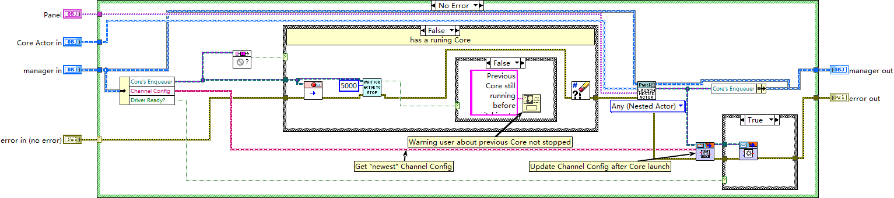

# manager — central hub and core switcher

- **Main class:** `manager/manager/manager.lvclass` (`manager.lvlib:manager.lvclass`), inheriting the
  vi.lib MGI `Monitored Actor` base class.
- **Entry VI:** `manager/manager/launch core.vi` — the manager's behavioral center of gravity. There is
  no `Actor Core.vi` override anywhere under `manager/` (verified by file search), so the manager inherits
  the Monitored Actor core unchanged and concentrates its behavior in `launch core.vi` plus the `on_*`
  message handlers.

Module size: 108 files (81 `.vi`, 26 `.lvclass`, 1 `.lvlib` = `manager/manager.lvlib`, no `.ctl`), with
20 message classes — the largest message inventory of any tier.

## Manager actor state

Private data carries four fields: `Managed Enqueuers` (an array of queue references, one per managed
actor or panel), `Core's Enqueuer`, `Channel Config`, and `Driver Ready?`. The class has 24 members,
among them the private static adapter bookkeeping `load adapter.vi`, `register adapter.vi` and
`remove adapter.vi`, plus the public `manager/manager/load adapters.vi` that installs the four panel
adapters at startup. The manager therefore owns: which actors/panels are running (enqueuer array), the
channel configuration in force, the last known driver-ready state, and the adapter hooks.

## launch core.vi — the Core switching orchestration

`launch core.vi` starts a new Core actor and gracefully replaces the previous one. Its "No Error" case:

1. Unbundle `Core's Enqueuer`, `Channel Config` and `Driver Ready?` from the manager object.
2. If an enqueuer is present (a "runing Core" exists — label typo preserved from the source):
   send the AF `Stop Msg` (`Send Normal Stop.vi`), wait for the actor to stop with a 5000 ms timeout,
   clear errors; if the actor did not quit, show a one-button dialog
   "Previous Core still running before switching to new Core." A first launch simply passes through.
3. Launch the new Core as a *nested* panel actor (`Panel Actor.lvclass:Launch Root Panel.vi`,
   instance `Launch as Nested Actor.vi`).
4. Push the channel configuration *after* the launch, as a message:
   `Core.lvlib:Update Drivers Msg.lvclass:Send Update Drivers.vi` with the new Core's enqueuer.
5. Bundle the new enqueuer back into the manager object.
6. Replay the previous `Driver Ready?` state to the new Core via
   `Core.lvlib:Set Driver Ready Msg.lvclass:Send Set Driver Ready.vi`.

Error handling: a failing stop surfaces as the dialog above and is then cleared so the new launch can
proceed; all other errors pass through untouched.

`manager/manager/launch core.vi` replacing the previous Core actor with a newly launched one.

## The adapter pattern

The manager decouples itself from concrete panel classes through adapters. The base class
`manager/adapter/adapter.lvclass` defines four overridable hooks — `on_measure.vi`, `on_pre_measure.vi`,
`on_post_measure.vi`, `on_update_config.vi` — plus `Read Actor's Enqueuer.vi` / `Write Actor's
Enqueuer.vi`. Four per-panel adapters override the hooks their panel needs:

| Adapter | Overrides present |
|---|---|
| `manager/ConfigViewer_adapter/` | `on_pre_measure.vi`, `on_post_measure.vi`, `on_update_config.vi` |
| `manager/DataLogger_adapter/` | `on_measure.vi`, `on_pre_measure.vi`, `on_update_config.vi` |
| `manager/DataTipper_adapter/` | `on_measure.vi`, `on_update_config.vi` |
| `manager/Plotter_adapter/` | `on_measure.vi`, `on_pre_measure.vi`, `on_update_config.vi` |

Measurement events flow through these hooks to the panels (ConfigViewer, DataLogger, DataTipper,
Plotter) without the manager naming any concrete panel class. The panels themselves are documented in
`docs/modules/panels.md`.

## Manager message classes (20)

`launch core`, `launch managed actor`, `launch managed panel`, `launch new plotter`,
`on_connection_checked`, `on_driver_ready_changed`, `on_enable_selection_changed`, `on_handle_menu`,
`on_hot_sim_switch`, `on_load_config`, `on_measure`, `on_post_measure`, `on_pre_measure`,
`on_reinit_drivers`, `on_subpanel_layout_updated`, `on_switch_core`, `on_update_enable`,
`stop all managed actors`, `stop managed actor`, `stop other managed actors`. The `launch managed actor`
/ `launch managed panel` / `stop (all|other) managed actors` group implements the manager's registry of
child actors through the `Managed Enqueuers` array.

## Notes for readers

- `cores/load_actors.vi` is listed in the project tree under the manager virtual folder, but the file
  physically lives in `cores/` — project tree and disk layout are two different views (see
  `docs/architecture.md`).
- The manager carries `Channel Config` and `Driver Ready?` as *its own* state and pushes both to a newly
  launched Core by message — configuration is never set before launch.
- Documentation baseline: Wave 1 class probes and the Wave 2 deep read of `launch core.vi` under
  `.omz/tmp/lvmcp-docs/`; nothing here is inferred beyond those artifacts.
