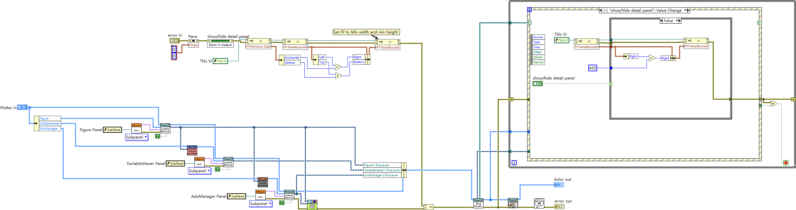

# panels — UI panel actors and the plotting subsystem

- **Main class:** `panels/MicaSubpanel/MicaSubpanel/MicaSubpanel.lvclass`
  (`MicaSubpanel.lvlib:MicaSubpanel.lvclass`), inheriting the vi.lib MGI `Panel Actor` base. MicaSubpanel
  is the panel-side root of the measurement-core lineage: `Core.lvclass` inherits it, which is what lets
  measurement cores be swapped into the main window's subpanel.
- **Entry VI:** `panels/Plotter/Plotter/Plotter/Actor Core.vi` — the deepest panel-actor startup read in
  this pass, and the representative pattern for the tier. Individual panels are started by their own
  launch VIs (e.g. `panels/About/launch about.vi`, `panels/WaitingModal/launch waiting modal.vi`,
  `panels/Check for Update/launch Check for Update.vi`).

Module size: 265 files (193 `.vi`, 53 `.lvclass`, 19 `.lvlib`). The project tree groups them into 13
panel entries; on disk these resolve to 19 libraries, of which 8 belong to the Plotter subsystem.

## MicaSubpanel — the subpanel host

`MicaSubpanel.lvclass` holds a subpanel refnum field and exposes `Read Subpanel.vi`,
`Write Subpanel.vi`, `Update Layout.vi`, `Read Actor Core Size.vi` and `Get Actor Core Size.vi`. One
deliberate boundary crossing to know about: `Get Actor Core Size.vi` physically lives in
`cores/Core/Core/` while being a MicaSubpanel member — together with Core inheriting MicaSubpanel, the
cores/panels boundary is porous in exactly two places, by design.

## Plotter subsystem (8 libraries)

`panels/Plotter/` contains eight libraries: `Plotter`, `Figure`, `VariableViewer`, `AxisManager`,
`TwoAxisManager`, `ThreeAxisManager`, `XY Figure`, `Intensity Figure`.

`Plotter.lvclass` inherits `Outputers.lvlib:Outputers.lvclass` (itself a Panel Actor child carrying
`data` and `axis` arrays) and hosts three nested panel actors — Figure, VariableViewer, AxisManager —
in three subpanels. Its `Actor Core.vi`:

1. Opens VI Server references to its own front panel and the three subpanels, bundles the nested
   `Figure`, `VariableViewer`, `AxisManager` enqueuer/instance fields, and zeroes the pane origin.
2. Creates the three subpanel shells (`Panel.lvlib:Subpanel.lvclass:Subpanel.vi`), then launches
   Figure, VariableViewer and AxisManager as nested panels (auto-stop on each).
3. Cross-wires the enqueuers — the data-flow heart: AxisManager and VariableViewer each receive Figure's
   enqueuer (`Update Figure Enqueuer.vi`), Figure receives AxisManager's enqueuer via the
   `Update AxisManager Enqueuer Msg` message, and all three enqueuers are bundled into the Plotter
   object.
4. Shrinks the window to its computed minimum bounds, registers for events (first observed case:
   `show/hide detail panel`: Value Change) and enters the parent event loop.

Plotter's private data matches this wiring: twelve fields including redraw interval (100 ms),
max frame number, plotting frame index limits, the GUI refnums cluster, a timed-redraw notifier, and the
enqueuer/instance references for its three satellites.

The satellites split the work: `Figure` owns drawing (`Draw.vi`, `Pre-draw.vi`, `Post-draw.vi`,
`Redraw.vi`, `Replace Data.vi`, axes formula and variables messages); `VariableViewer` shows the raw
variables (`Update GUI on Write axis.vi`, `store_frame.vi`, `wipe_data.vi`); `AxisManager` (and its
two-/three-axis variants `TwoAxisManager`, `ThreeAxisManager`) own axis configuration and formula
status; `XY Figure` and `Intensity Figure` are the two figure flavors corresponding to the Plot Type
enum (XY / Intensity) of `utility/AppConfig/`.

`panels/Plotter/Plotter/Plotter/Actor Core.vi` launching Figure, VariableViewer and AxisManager into
three subpanels and cross-wiring their enqueuers.

## Managed panel actors

These panel actors are launched and stopped by the manager (see `docs/modules/manager.md`) and receive
measurement events through the manager's adapter hooks. What these panels look like and how an operator
uses them (menus, measurement/record/config/data panels, the Plotter window) is documented in
[user-manual.md](../user-manual.md), "UI tour":

| Library | Role (from its members and messages) |
|---|---|
| `panels/ConfigViewer/` | Channel configuration tree; messages `on_pre_measure`, `on_post_measure`, `on_enable_selection_changed`, `update_content`, `update_enable`, `update Connection Status`. |
| `panels/DataLogger/` | Data-file writer; carries a `dataFilePath` accessor and messages `Write dataFilePath`, `generate_new_datapath`, `recordDataCaption`; `store_frame.vi` writes frames; `AxisToDataCaption.vi` maps axes to column captions. Produces the tab-delimited files read by `utility/parse MICA data file.vi`. |
| `panels/DataTipper/` | Data tooltip/readout; `Parse Frame.vi`, `Write axis.vi`, `Update GUI on Write axis.vi`, `store_frame.vi`. |
| `panels/HistoryLogger/` | Measurement history list; messages `Handle History Record`, `Collapse History Field`, `Expand History Field`; `Update Layout.vi`. |
| `panels/WaitingModal/` | Modal wait dialog; message `Update Message`; also hosts `panels/WaitingModal/Splash Screen.vi`. |
| `panels/About/` | About dialog; `Actor Core.vi` plus `launch about.vi`. |
| `panels/Check for Update/` | Update checker; messages `Check`, `Download`, `Update`; members `Check.vi`, `Download.vi`, `Update.vi`, `Write App Loop Event.vi`. |
| `panels/CoreSelectionPanel/` | Core picker; `Show Core List Dialog.vi` (+ message), `Get Available Modes.vi`, `Set Visible Modes.vi`, `Update Layout.vi`. |
| `panels/QuickAccessBar/` | Quick-access toolbar; `Actor Core.vi` only — role not deep-read in this pass. |
| `panels/Outputers/` | Base data-output panel actor (data/axis arrays; `store_frame`, `wipe_data`, `Write axis` messages) that Plotter inherits from — listed here for completeness. |

## Panel utility VIs

`panels/utility/` holds four loose VIs: `AutoNamerDatExtraArtem.vi`, `mouseDownPos.vi`,
`onSlide_scale.vi`, and `Get APP Version.vi` (the latter's disk location is `panels/utility/` although
the project tree lists it under the utility virtual folder — project tree and disk layout differ again).

## Notes for readers

- Panels never call drivers and never run measurement loops; they consume frames and axis updates pushed
  through messages (`store_frame`, `Write axis`, `wipe_data`) and manager adapter hooks.
- The manager-side counterparts of the four hook-receiving panels are the adapters under `manager/`
  (`ConfigViewer_adapter`, `DataLogger_adapter`, `DataTipper_adapter`, `Plotter_adapter`).
- Documentation baseline: Wave 1 class probes (Plotter, Outputers, MicaSubpanel) and the Wave 2 deep
  read of the Plotter Actor Core under `.omz/tmp/lvmcp-docs/`; QuickAccessBar and the Plotter satellites
  are described from their member/message inventories only.
