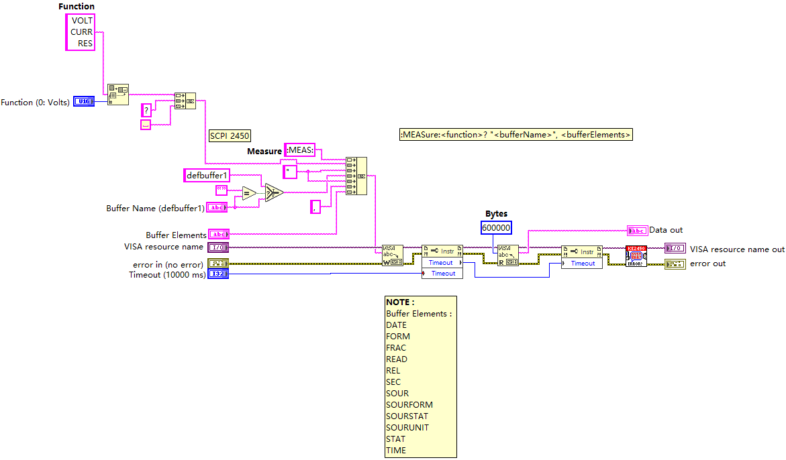
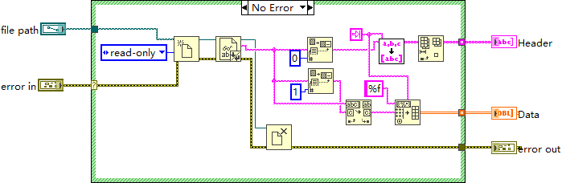

# utility — configuration, parsing and shared tool libraries

- **Main class:** `utility/AppConfig/AppConfig/AppConfig.lvclass` — a GOOP-style singleton holding the
  application configuration. It inherits the GOOP template class `G4BaseTemplate_Singleton_4x4x4`
  (six decoded template ancestor layers; the direct-parent order is not provable from the file, so it
  must not be documented as a linear chain). `GetInstance.vi` / `GetLock.vi` sit in the
  `protected//utils` interlayer; public members are `AppConfig_Init.vi`, `AppConfig_CleanUp.vi`,
  `Read config.vi`, `Write config.vi`, `Read Config (Block).vi`, `Write config (Unblock).vi`.
- **Entry VIs:** `utility/measure.vi` and `utility/parse MICA data file.vi` — the two standalone
  utilities deep-read in this pass. Neither is part of the startup chain.

Module size: 124 files (107 `.vi`, 3 `.lvclass`, 8 `.lvlib`, 5 `.ctl`, 1 `.vim`), plus a long tail of
loose VIs directly under `utility/`.

## The eight libraries

| Library | Contents |
|---|---|
| `utility/Channel Config/` | `Channel Config.lvlib` + `Channel Config.lvclass`: the in-memory channel configuration. Enabled-channel input/output accessors, axis name type read/write, simulation flag, time begin, and JSON serialization (`from Config json.vi`, `to Config json.vi`, `fron json file.vi` [sic], `to json file.vi`). The loose VI `utility/Channel Config/slot config to driver object.vi` bridges config slots to driver objects. |
| `utility/AppConfig/` | The AppConfig singleton class (no `.lvlib` of its own) plus the duplicate typedef pair `AppConfigType.ctl` == `Plot Type.ctl` — both carry the same "Plot Type" enum (XY / Intensity); "AppConfigType" is a misleading name. |
| `utility/LV-Argparse/` | `LV ArgParse.lvlib`, a Python-argparse-style command-line framework: `LV Argument Parser` class, `Argparse.vi`, `Get Typed Argument.vim` (the repository's only `.vim`), the full `Argument Definition.ctl` record (name, short/long, action enum, choices, const, default, dest, help, number, required, type enum) and `Program Info.ctl`. Typed getters: Get Bool/Date/Double/Int/Path/String/UInt. |
| `utility/Axis Tools/` | `Axis Tools.lvlib`: axis name generation (physical / mixed / instrument names), de-duplication, sorted array counts, axis backup — the naming engine behind the `typedefs/Axis Name Type.ctl` enum. |
| `utility/Layout Tools/` | `Layout Tools.lvlib`: VI-scripting layout helpers (align top edges, distribute horizontal/vertical gaps, fit front panel/subpanel to selections). |
| `utility/Panel Tools/` | `Panel Tools.lvlib`: window position offset and window width helpers. |
| `utility/Path Tools/` | `Path Tools.lvlib` plus the loose `utility/strip path level.vi`. |
| `utility/Version Tools/` | `Version Tools.lvlib`: `A newer than B.vi` and `version string to version numbers.vi` — the comparison behind the update checker. |
| `utility/ZolixOminiSpec/` | `ZolixOminiSpec.lvlib`: vendor protocol implementation for the OminiL spectrometer driver (OpenSpec, MoveToWave, Get/SetCurrentGrating, port input/output, success handler). |

(The AppConfig row is the library-less ninth group; the eight `.lvlib` files are the other rows.)

## Loose VIs worth naming

`Wait for Actor to Stop.vi` (used by the manager's core switch), `Calculate Sweep Data (step size).vi`
and `Calculate Sweep Data (sweep rate).vi`, `Get non-blocking output index.vi`,
`Get Buffer Actual Readings End.vi` (non-blocking measure support), `D-n to Vs.vi` / `Vs to D-n.vi` and
`search nearest data in 1D array.vi` and `CalculateNextValue.vi` (data math), `ms tick.vi`,
`Delay Modal.vi` / `Wait Stable Modal.vi` (modal dialogs), `Linear to Circular sequence.vi`,
`Get LV Class Name (no .lvclass)vi.vi`, `Copy From Folder To Folder.vi`, `Diff folder (inc).vi`, and
the release/update trio `Get Latest Release Info.vi` / `Download Latest Release.vi` (used by the
Check for Update panel).

## `utility/measure.vi` — raw SCPI measure helper

A standalone VISA source-measure utility demonstrating the "utility VIs call driver libraries directly"
pattern: its front panel exposes a VISA resource name, buffer name (default `defbuffer1`), function
(default "0: Volts"), buffer elements and a timeout (default 10000 ms). The diagram builds the SCPI
query `":MEASure:<function>? "`, issues it over VISA with a timeout property write, reads the reply, and
runs `Error Query.vi` afterwards. It references `Keithley 2450.lvlib` — the same vendor library the 2450
driver hooks use — but it is not a startup component and not called by the actor tier.

`utility/measure.vi` issuing a `:MEASure:` query over VISA and reading the reply.

## `utility/parse MICA data file.vi` — data-file parser

Reads a MICA data file into `Data` (2D double array) + `Header` (1D string array). Flow: open the file
read-only, read the text, split at the first line (header), parse the header with a TAB delimiter and
drop the first column label (the x-axis name), then convert the payload with a `%f` TAB-delimited
spreadsheet conversion. Error case passes empties through. This establishes the MICA data-file format:
tab-delimited spreadsheet text with at least one header line — the format `panels/DataLogger` writes.
The user-visible data-file layout (directory hierarchy, frame/column semantics, history viewing) is
documented in [user-manual.md](../user-manual.md), "Data files & results".

`utility/parse MICA data file.vi` splitting a tab-delimited MICA data file into header and data.

## Utility typedefs (5, all parsed)

`AppConfig/Plot Type.ctl` and the duplicate `AppConfig/AppConfigType.ctl` (enum XY / Intensity),
`AppConfig/AppConfig/protected/ObjectAttributes.ctl` (semaphore refnum for the singleton lock),
`LV-Argparse/LV Argument Parser/Argument Definition.ctl` and `.../Program Info.ctl`.

## Notes for readers

- `utility/` is the shared foundation layer: it depends on nothing above it, while cores, panels, the
  manager and the tools all consume it (Channel Config, AppConfig, Axis Tools, Version Tools, the data
  math VIs).
- The three utility classes (`AppConfig`, `Channel Config.lvlib:Channel Config`, and the LV-Argparse
  parser class) are the tier's only classes; everything else is VI libraries and loose VIs.
- Documentation baseline: Wave 1 typedef parse and inventory under `.omz/tmp/lvmcp-docs/`, plus the
  Splash-Screen/measure/pylv extracts and the Wave 2 deep read of `parse MICA data file.vi`. The
  ZolixOminiSpec, Layout/Panel/Path/Version Tools members are documented from the inventory only —
  their internals were not deep-read in this pass.
