# MICA User Manual

This is the full operating reference for MICA (Multi-Instrument Control and Automation). It assumes
you have installed the application and run a first simulation measurement - if not, start with the
[getting-started guide](getting-started.md). The sections cover the user interface, the four
measurement modes, the channel-configuration reference (including the code-adjudicated
supported-instrument table), worked examples, data files, logs and troubleshooting, maintenance and
update, and a closing list of notes, limitations and the validation workflow.

All UI screenshots in this manual were captured in Simulation mode (no hardware attached); each
figure caption repeats that annotation. Facts about the instrument registry, config schema and data
format are adjudicated against the code; where the application's reference manual and the code
disagree, the delta is annotated inline.

## 1. UI tour

(source: manual-extraction §3, L246-458; conflict registers C9, C10)

### 1.1 Main window layout

The main window is organized top-to-bottom: **menu bar**, **measurement panel**, **record panel**,
**config panel**, **data panel**, **log bar** - plus an error-indicator LED in the status bar. The
layout follows "control first, then record, then observe status". A second window type, the
plotter, opens separately and can exist multiple times.

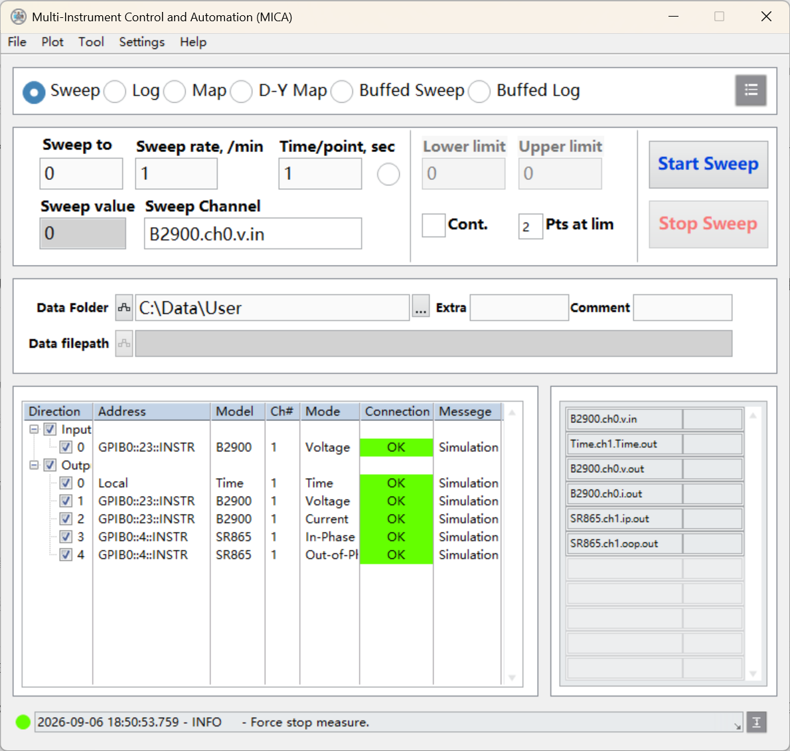
*Figure 1. The main window panorama: menu bar, measurement and record panels, config panel with the
channel table, data panel and log bar - captured in Simulation mode (no hardware attached).*


*Figure 2. The main window together with a "Plotter: Live" window showing the curve drawn from the
running measurement - captured in Simulation mode (no hardware attached).*

### 1.2 The five menus

| Menu | Items | Purpose |
|---|---|---|
| File | Load Config | Load a channel configuration; instruments connect automatically |
| | Re-init Driver | Reconnect and reconfigure the instruments without changing the config file |
| | Close | Exit; files are saved and instruments disconnected |
| Plot | New Plot | Open a live plot window, titled "Plotter: Live" |
| | New Plot from File | Open a MICA data file; the window is titled after the data file |
| | Plot Type | Switch the plot representation: XY curve or Intensity 2-D image |
| | Close All Plot | Close every open plot window |
| Tool | Config Editor | Open the channel-config editor |
| Settings | Simulation | Replace instrument readings with simulated values |
| | Load after Start | Pop the config file-selection dialog at startup |
| | Debug log | Verbose log output |
| Help | Feedback | Open the project issue page |
| | Check for Updates | Open the update window (section 7) |
| | About MICA | Version and project information |

The Settings toggles are stored in the launcher INI file (`[Settings]` keys `Simulation`,
`Load after Start`, `Debug Log`) and are read at startup - a change applies at the next launch.

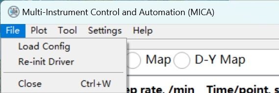
*Figure 3. The File menu: Load Config, Re-init Driver, Close - captured in Simulation mode (no
hardware attached).*

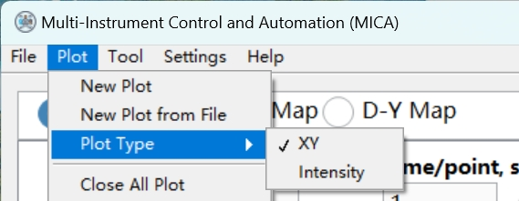
*Figure 4. The Plot menu: New Plot, New Plot from File, Plot Type, Close All Plot - captured in
Simulation mode (no hardware attached).*

The Tool, Settings and Help menus are short enough that the table above covers them completely.

### 1.3 Measurement panel

The measurement panel is the mode selection bar, the per-mode parameter area and the start/stop
controls. Switching the selected function **during** a measurement auto-stops the run and switches
mode. The four modes and their parameters are documented in section 2.

### 1.4 Record panel

The record panel sets the data folder. On each measurement start, MICA generates the date-time
directory structure and the file name and shows the full path live in the **data file path**
indicator. Two optional fields - extra filename info and comment - should be filled with
sample/batch/environment notes **before** measuring. The record panel remembers the last data path
across restarts; re-verify it before each measurement.


*Figure 5. Record panel close-up: the data folder setting and the live data-file-path indicator -
captured in Simulation mode (no hardware attached).*

### 1.5 Config panel and data panel

The config panel shows the channels defined by the loaded config file as a table - Direction,
Address, Model, Ch#, Mode, Connection, Message - with per-channel enable selection. It is the
first-stop check after loading a new config or rewiring (the connection-check workflow is in
section 6). The data panel is a simple list of the current values of all channels (input and
output); it complements the plotter for at-a-glance state.

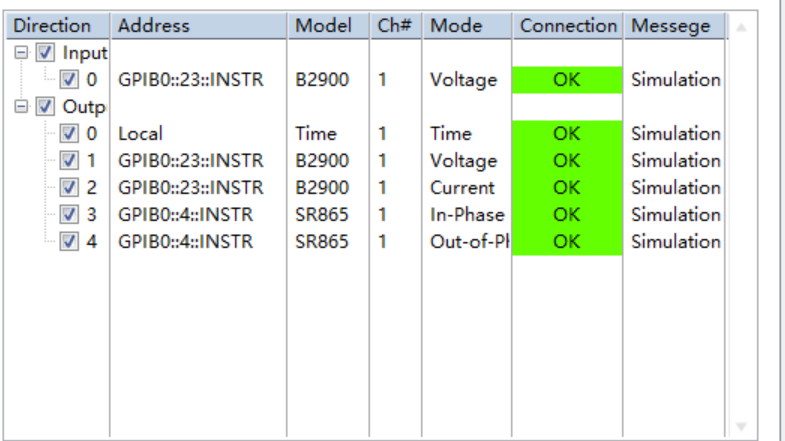
*Figure 6. The config panel's channel table with connection states - captured in Simulation mode
(no hardware attached).*

### 1.6 Plotter window

Live and historical data share the same plotter UI. The window menu offers Close and Close Other
Plots (keeps only the current window). The plot panel has axis-range sliders at the bottom and
right edges; right-clicking the toolbar area changes the chart form. The toolbar offers Plot
Visible, Common Plots, Color / Line Style / Line Width, X Scale / Y Scale, and Export (saves the
chart as an image). The plot-settings panel selects which data columns map to the X and Y axes and
carries the per-graph-type display options.

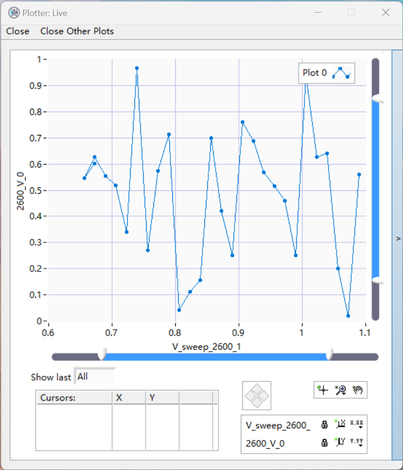
*Figure 7. A "Plotter: Live" window with the plot panel, toolbar and plot-settings panel -
captured in Simulation mode (no hardware attached).*

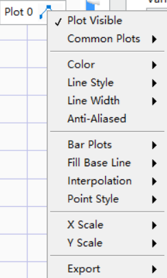
*Figure 8. The plotter toolbar strip: Plot Visible, Common Plots, color and line controls, axis
scales, Export - captured in Simulation mode (no hardware attached).*

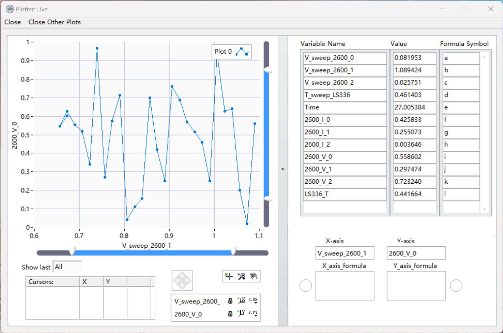
*Figure 9. The plotter's extended view with the variable list used to pick X/Y columns - captured
in Simulation mode (no hardware attached).*

Two behaviors to remember: opening a new file or starting a new measurement clears the current
plot - use Export first if you want to keep the picture - and closing a plot window never touches
the data file.

## 2. Measurement modes

(source: manual-extraction §4, L461-577; core config typedefs verified)

The function-selection bar offers four core modes - **Sweep**, **Log**, **Map** and **D-Y Map** -
plus two extended modes, Buffed Sweep and Buffed Log, whose existence is documented but whose
parameters are not covered by the reference manual. Mode choice never requires driver or
recording-structure changes, and switching mode mid-measurement auto-stops the run (section 1.3).

### 2.1 Sweep

Sweep drives one output channel continuously or stepwise while recording all enabled input and
output channels.


*Figure 10. The Sweep parameter panel - captured in Simulation mode (no hardware attached).*

| Parameter | Meaning |
|---|---|
| Sweep Channel | the output channel being swept |
| Sweep to | target end value of the sweep |
| Sweep rate /min | rate of change of the swept channel |
| Time/point sec | settle time before each recorded point; set per the instrument's response |
| Lower limit / Upper limit | bounds of the round-trip shape |
| Pts at lim | extra points held at each boundary |
| Cont. | continuous back-and-forth between the limits until stopped |

Two usage shapes: a one-way sweep to the target value, or a bounded round-trip between the limits.
While running, the software advances the swept channel at the set rate and records all channels at
each settled point. For unknown samples, start with a slow rate and a narrow range.

### 2.2 Log

Log mode records while the operator adjusts conditions - pre-tuning, instrument bring-up,
stability observation, manually stepped tests. Start Log / Stop Log control the run; Time/point sec
is the record interval; Input Channels selects what to read. Readings and timestamps are written at
each interval. The **Last loop late?** indicator warns when the record loop is lagging behind the
set interval.

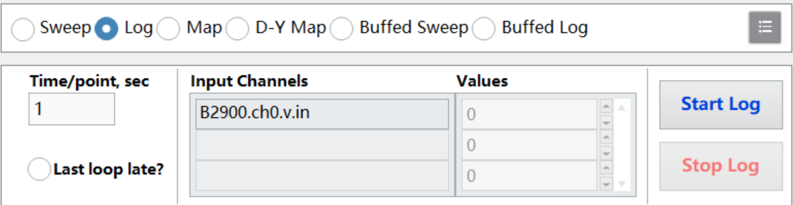
*Figure 11. The Log parameter panel with start/stop, record interval, input-channel selection and
the loop-late indicator - captured in Simulation mode (no hardware attached).*

### 2.3 Map

Map is a 2-D scan over two control quantities. Both Map Channels X and Y must be writable channels.
X takes an X rate /min, a Time/point sec and Lower/Upper limits; Y takes Lower/Upper limits and is
stepped by Y slices. X is always the fast scan direction.

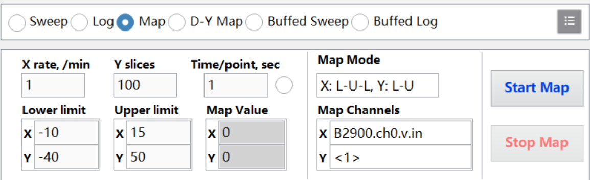
*Figure 12. The Map parameter panel with X/Y channel selection, rates, limits and slices -
captured in Simulation mode (no hardware attached).*

Three start strategies exist, and the choice matters:

1. **Jump to the lower limits** - move to the X lower limit and the Y lower limit at start; X
   cycles lower↔upper while Y advances from the lower limit.
2. **Start from the current position** - X cycles current→upper→lower→current while Y advances from
   the current position; this resumes partially covered areas.
3. **Move X to its lower limit** - X goes to its lower limit at start, Y stays at the current
   position; X cycles while Y advances from the current position.

Strategies 2 and 3 preserve the sample's current state; use them when the operating point must not
be disturbed.

### 2.4 D-Y Map

D-Y Map is a dual-control coupled 2-D mode. You configure the D and Y control axes plus a
four-channel mapping - Vtg, Ctg, Vbg, Cbg - with conversion parameters, and the software converts
the mapping into write sequences on the mapped channels. Parameters: D rate /min, Y step and layer
count n, and Time/point sec and limits as in Sweep. Verify the mapped channels' ranges and units
before editing the mapping.

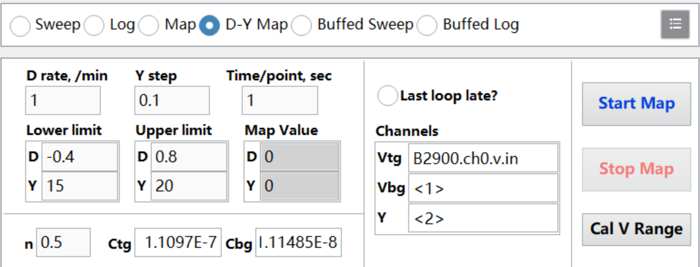
*Figure 13. The D-Y Map parameter panel with the D/Y axes, the Vtg/Ctg/Vbg/Cbg mapping and the Y
step/layer controls - captured in Simulation mode (no hardware attached).*

## 3. Channel configuration reference

(source: manual-extraction §5, L580-705; driver registry and shipped configs verified; conflict
registers C1-C5)

### 3.1 File structure and the channel keys

Start from the closest sample in the `configs/` directory rather than writing a config from
scratch. Directory conventions: the configs root holds quick-start and comprehensive samples,
`configs/examples/` holds per-device templates, `configs/test/` holds special combinations and
boundary cases, and `configs/production/` holds stable deployed versions.

Configs are loaded with File → Load Config. A config document contains two arrays:

- **input** - the quantities the software sets on instruments;
- **output** - the quantities recorded.

Almost every config keeps a `Time` channel (model `Time`, `address` `Local`) as the first output
entry for ordering.


*Figure 14. The Load Config file dialog - captured in Simulation mode (no hardware attached).*

Each channel entry carries these keys:

| Key | Meaning |
|---|---|
| `address` | instrument address - VISA form (`GPIB0::22::INSTR`), the serial/USB address form for such instruments, or `Local` for local simulated channels |
| `channel` | physical channel number on the instrument |
| `model` | selects the communication/control logic; one model can serve many channels |
| `mode` | which reading the channel carries (see the mode values below) |
| `extra-parameters` | per-device keys, documented per group in section 3.3 |
| `name`, `short` (optional) | display names; they appear in the main window, in record files and in plot legends - use stable, semantic names |

**Same-port multi-reading** is normal: one instrument can appear several times with an identical
`address` (and `channel`) and distinct `mode` values - one lock-in declaring In-Phase and
Out-of-Phase readings, for example. Same-address channels with different names are one instrument's
multiple readings, not a config error.

Modification checklist before loading a changed config: the template matches the system; addresses
and physical channels match the wiring; unrelated channel entries are removed; names are checked;
default enable states are checked. Changes apply on reload.

### 3.2 Supported instruments and models

The table below is adjudicated from the driver registry in the code (`drivers/load_drivers.vi`,
which registers roughly 68 model classes across 16 families). Where the reference manual's sample
lists differ, the delta is annotated in the last column. The full class-level matrix - inheritance,
probed fields - is in [modules/drivers.md](modules/drivers.md).

| Family | Models registered in code (examples) | Typical mode values | Manual delta |
|---|---|---|---|
| BaseDriver (root) | - | - | shared root of the tier; carries the Raw/Sim operation split |
| SourceMeter (middle layer) | - | Voltage, Current | parent of the Keithley, Keysight B29xx and LakeShore LSM81 lines; carries `autorange` / `compliance` |
| Keithley | 2182; 2400, 2401, 2410, 2420, 2425, 2430, 2440; 2450, 2470; 2600, 2601B, 2602B, 2604B, 2606B, 2611B, 2612B, 2614B, 2634B, 2635B, 2636B; 4200; 6220, 6221 | Voltage, Current (SMUs); Amplitude, Frequency, Offset (6221 waveform output) | only `2182` is registered - the manual's sample list also names 2182A, and some config files spell `2182A`; their load behavior is unverified. The manual's vendor list writes "6200 series" current source; code registers 6220/6221 |
| Keysight | B2900 family - 15 B29xx model leaves incl. B2912A, B2912B | Voltage, Current | the manual's §5.2 sample list omits B2900, but the model is registered in code and used by the manual's own worked example - supported |
| LakeShore | LSM81 line (LSM81 + variants); LS155; LS336 | Temperature (LS336, LS155); Amplitude (LSM81 source) | the manual's vendor list names the M81 Synchronous Source Measure System and a 155 AC/DC source alongside the LS336 temperature controller |
| Lock-in Amplifier (middle layer) | - | In-Phase, Out-of-Phase | carries `auto-phase` and related booleans |
| SRS | SR830, SR865 | In-Phase, Out-of-Phase; sample configs also use Amplitude, Phase, RMS-style values | the manual's vendor list writes SR865A; the registered model class is SR865 |
| Controller (middle layer) | - | Temperature, Magnet | carries `delay-second` / `wait-stable` / `wait-for-channel` |
| Mercury | Mercury, iTC, iTC-Heliox, iPS | Temperature (iTC); Magnet (iPS) | the manual's vendor list names the Oxford TeslatronPT system (Mercury iTC, iTC-HelioxVT, iPS) |
| Quantum Design | PPMS | Temperature, Magnet | the manual names the Dynacool PPMS |
| Kelvince | Kelvinion; ZN-MPS | Temperature (Kelvinion); Magnet (ZN-MPS) | the manual names the Multifields ColdTUBE system (Kelvinion thermostat, ZN 4Q magnet power controller) |
| Optical Power Meter (middle layer) | - | Power | 0-field middle layer for the power-meter family |
| NOVAII | NOVAII | Power | the manual names the Ophir NOVA II laser power meter |
| OminiL | OminiL | Wavelength; Shutter (written or recorded) | the manual names the Zolix OminiL Spec SDK monochromator; extra parameters `USB-mode`, `grating` |
| RNG | RNG (local) | RNG | local random-number channel; `address` `Local` |
| Time | Time (local) | Time | local time channel; `address` `Local`; conventionally the first output entry |

Mode values: common values include Voltage, Current, Time, Temperature, In-Phase, Out-of-Phase,
Frequency, Magnet, Amplitude, Angle, Offset, Power, Pressure, RNG, Shutter, Wavelength and Leak
Rate; sample configs additionally use values such as Modulus, Phase, Wave, Duty, RMS, Negative
Peak, Positive Peak, Peak to Peak, Flow and Temperature Setpoint. The list is not exhaustive - when
adapting a sample, follow the same-model sample's mode values.

Three annotations on that table:

- **B2900 is supported.** It is absent from the reference manual's §5.2 sample-model list, which is
  non-exhaustive; the code registry registers the Keysight B2900 family and the manual's own
  worked example uses it (section 4.2).
- **Do not build on UL200.** A leak-detector model spelled UL200 appears in one shipped sample
  config, but no driver for it exists in the registry; it is not presented here as a supported
  instrument.
- **2182, not 2182A.** Only `2182` is registered. Config files spelling `2182A` exist; their load
  behavior is unverified.

Local channels - model `Time` or `RNG` with `address` `Local` - validate the config and measurement
flow without any instrument. If a needed model is missing from the samples, adapt a same-class
sample and verify communication with a small config first.

### 3.3 Extra-parameter key tables

Extra parameters are per-device keys inside the `extra-parameters` object, grouped by channel class.

**Source and power channels** (Keithley SMUs, Keysight B29xx, LSM81, waveform current sources):

| Key | Applies to | Meaning |
|---|---|---|
| `autorange` | output channels | let the instrument select its output range automatically |
| `shape` | input (readback) channels | match the readout to the excitation: DC, AC or Square - e.g. AC excitation read through a lock-in |
| `compliance` | output channels | current limit / compliance protecting the sample; too loose gives no protection, too tight limits normal output |
| `amplitude`, `frequency`, `offset` | waveform-capable sources (e.g. the 6221 current source) | waveform output parameters |
| `non-block` | at most one channel per SMU | aggressive non-blocking scheduling. Supported through the generic driver path but validated only on the 2636B; the voltage and current channels of one SMU cannot both enable it. Compare data files with it on vs off for pacing and dropped readings |

**Nanovoltmeter channels** (2182): `autozero`, `autorange`.

**Lock-in channels** (SR830, SR865): read-only configs are simple. When a lock-in also excites,
declare its channels in both input and output. Choose the reference source - internal, or external
(which must be same-origin as the excitation; key names differ per model, so follow the same-model
sample). `auto-phase` auto-calibrates the phase before measuring.

**Temperature/environment channels** (Controller family - LS336, iTC, PPMS, Kelvinion):

| Key | Meaning |
|---|---|
| `delay-second` | wait this long after a setpoint change before continuing |
| `wait-stable` | stability threshold; set it above the instrument's readout noise |
| `wait-for-channel` | which channel to wait on before continuing |

Magnet supplies split set and read: the supply channel sets the field while a `Magnet`-mode channel
reads it.

**Optical, vacuum and auxiliary channels:** local channels generate the time and random-number
readings; power-meter channels log illumination; the monochromator takes `USB-mode` and `grating`;
the `Shutter` mode can be written or recorded.

## 4. Worked examples

(source: manual-extraction §6, L707-821; shipped configs verified programmatically; conflict
registers C11, C12)

### 4.1 No-instrument simulation

The shortest example is `configs/config_time_rng.json` - one local `Time` input, `Time` + `RNG`
outputs, no instrument addresses; it runs identically on any machine with MICA installed:

```json
{
  "input": [
    { "address": "Local", "channel": 1, "model": "Time", "mode": "Time", "extra-parameters": {} }
  ],
  "output": [
    { "address": "Local", "channel": 1, "model": "Time", "mode": "Time", "extra-parameters": {} },
    { "address": "Local", "channel": 1, "model": "RNG",  "mode": "RNG",  "extra-parameters": {} }
  ]
}
```

Fixed validation order: enable simulation → load the config → run a short measurement → stop →
inspect the data file and the curves. What to check: the config loads, Sweep/Log start, the data
file is generated, the plotter shows curves.


*Figure 15. A simulation measurement in progress on this config: live values in the data panel and
"Measure started." in the log bar - captured in Simulation mode (no hardware attached).*

The extended sample `configs/config_time_rng_duplicate_channels.json` (four `Time` and two `RNG`
output channels) demonstrates multi-column same-frame recording and multiple curves. Simulation
curves come from local random numbers - their shape proves nothing about a real instrument's
response.

### 4.2 Photoresponse test system

Hardware trio: a sourcemeter provides bias and DC readback, a lock-in amplifier reads the weak AC
response under modulated light, and a laser power meter records the light reference. Typical
instruments: a B2900-series SMU for bias + DC, an SR865 lock-in, a NOVA II power meter; B2900 and
SR865 on GPIB, the power meter on USB.

The base config `configs/config_lab_test_YTC.json` (verified: one B2900 Voltage input at
`GPIB0::23`; outputs are local Time, B2900 Voltage, B2900 Current, SR865 In-Phase and SR865
Out-of-Phase), abridged:

```json
{
  "input": [
    { "address": "GPIB0::23::INSTR", "channel": 1, "model": "B2900",
      "mode": "Voltage", "extra-parameters": {} }
  ],
  "output": [
    { "address": "Local",           "channel": 1, "model": "Time",  "mode": "Time",
      "extra-parameters": {} },
    { "address": "GPIB0::23::INSTR", "channel": 1, "model": "B2900", "mode": "Voltage",
      "extra-parameters": {} },
    { "address": "GPIB0::23::INSTR", "channel": 1, "model": "B2900", "mode": "Current",
      "extra-parameters": {} },
    { "address": "GPIB0::4::INSTR",  "channel": 1, "model": "SR865", "mode": "In-Phase",
      "extra-parameters": {} },
    { "address": "GPIB0::4::INSTR",  "channel": 1, "model": "SR865", "mode": "Out-of-Phase",
      "extra-parameters": {} }
  ]
}
```

Run it with Sweep mode for programmed bias sequences or Log mode for manual stepping. Set values
and readings land in one frame, so the recorded bias and the recorded response correspond
point-for-point.

The Nova variant `configs/config_lab_test_Nova_YTC.json` adds one NOVAII power channel over USB,
with everything else identical. Its USB VISA address carries the device's serial number; shown here
in generic form - read the actual address from the instrument or from the VISA runtime's resource
list: `"address": "USB0::<vendor-id>::<model-code>::<serial>::0::INSTR"`.

### 4.3 Multi-physics measurement system

A temperature-controlled electrical measurement: an LS336 temperature controller plus two
2636-series sourcemeters (one dual-channel on GPIB, one single-channel on USB), three instruments
in total. The representative config is
`configs/production/config_LS336_dual_2636-input1T3V-delay-wait.json`; the series ships in three
variants with identical channel structure - 4 inputs (three SMU Voltage readings and the LS336
Temperature) and 8 outputs (Time, three Current, three Voltage, one Temperature) - differing only
in the LS336 extra-parameters:

| Variant | LS336 `extra-parameters` |
|---|---|
| `config_LS336_dual_2636-input1T3V.json` | (none) |
| `config_LS336_dual_2636-input1T3V-delay.json` | `"delay-second": 10` |
| `config_LS336_dual_2636-input1T3V-delay-wait.json` | `"delay-second": 10`, `"wait-stable": 0.05`, `"wait-for-channel": 1` |

Abridged shape of the `-delay-wait` variant (the USB-connected SMU's address shown in generic form;
the shipped file lists all twelve channels):

```json
{
  "input": [
    { "address": "GPIB0::26::INSTR", "channel": 2, "model": "2600", "mode": "Voltage",
      "extra-parameters": { "autorange": true } },
    { "address": "USB0::<vendor-id>::<model-code>::<serial>::INSTR", "channel": 1,
      "model": "2600", "mode": "Voltage", "extra-parameters": { "autorange": true } },
    { "address": "GPIB0::28::INSTR", "channel": 1, "model": "LS336", "mode": "Temperature",
      "extra-parameters": { "delay-second": 10, "wait-stable": 0.05, "wait-for-channel": 1 } }
  ],
  "output": [
    { "address": "Local",            "channel": 1, "model": "Time",  "mode": "Time",
      "extra-parameters": {} },
    { "address": "GPIB0::28::INSTR", "channel": 1, "model": "LS336", "mode": "Temperature",
      "extra-parameters": {} }
  ]
}
```

Note the model spelling: the shipped JSON declares `"model": "2600"` on the SMU channels even
though the physical instruments are 2636-series - 2636B resolves as a model alias within the 2600
family in the driver tree. Run all three variants on the same hardware to compare pacing; start
temperature scans from the `-delay-wait` variant. The naming convention encodes the channel mix:
`input1T3V` = 1 temperature + 3 voltage inputs.

## 5. Data files & results

(source: manual-extraction §7, L823-895; conflict registers C7, C8; data-file parser verified)

The data root is set in the record panel and persisted in the launcher INI file
(`[Logger] Data Folder Path`; default `C:\Data\User`). On each measurement start, MICA creates a
date directory under the root - a year level, a month level, then a day level (month = full English
name; day = month abbreviation + day + two-digit year) - and writes the measurement file inside it:

```text
<Data root>\                      default: C:\Data\User
  Year2026\
    January2026\
      Jan0726\
        Jan0726x020.dat           one measurement = one file
```

The file name is the date string, an `x`, and a three-digit serial (`Jan0726x020.dat`); serials
auto-increment within the day directory without collision, and the directories are created
automatically. One measurement equals one file; serials order same-day runs. The record panel's
data-file-path indicator shows the live target file (Figure 5). Never rename or move a file or its
directory while it is being written, and watch disk space on long runs.

About the date computation, one caveat: the reference manual reports that the date-directory
computation carries a fixed nine-hour offset, so a measurement started near midnight may be filed
under the neighboring calendar date (reported by the reference manual; not verified against the
current build). Treat it as stated behavior, not as a configurable setting.

**File content.** Columns come from the loaded channel config: input channels contribute set-value
columns, output channels contribute reading columns. Data is written frame by frame, appended; one
frame carries the set values and the readings together. Column names are the config's channel
names - identical to the config panel display - and the column count covers enabled channels only;
a missing expected column usually means the channel is not enabled. The format is TAB-delimited
text with a header line (`utility/parse MICA data file.vi` reads it back; its first column label is
discarded on parse). Changing the config changes the columns of subsequent files; keep one config
per experiment series so files align column-wise.

**History.** Reopen data files with Plot → New Plot from File; historical plots offer the same X/Y
and display interactions as live plots, with the file's columns appearing in the plot-settings
panel. Multiple plot windows are supported; Close Other Plots keeps only the current one. Opening a
new file or starting a new measurement clears the current plot - Export (toolbar) saves the chart
as an image before you switch. With many columns, filter in the variable-viewer sub-panel first.
Closing a plot window never touches the data file. Archive the channel config and experiment notes
alongside each data file.

## 6. Logs, status & troubleshooting

(source: manual-extraction §8, L897-969; conflict register C6)

**Log bar.** The log bar at the bottom of the main window confirms config loads, instrument
initialization, measurement start/stop and anomalies; entries are ordered by occurrence. It keeps a
bounded, recent window of entries - the reference manual reports the 64 most recent, with older
ones overwritten (reported by the reference manual; not verified against the current build) - so
record anomalies promptly. If the log is silent while a measurement runs, cross-check the data
panel for live updates.


*Figure 16. The log bar with the status LED green and an INFO entry - captured in Simulation mode
(no hardware attached).*

The **Debug log** toggle (Settings → Debug log) switches the log to verbose output. It is read at
startup, so the change applies at the next launch.

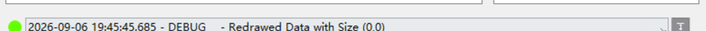
*Figure 17. The log bar with DEBUG-level entries enabled - captured in Simulation mode (no
hardware attached).*

**Connection checks.** After loading a config, the config panel lists every channel with its
connection state; verify address, channel number and enable state against the wiring. Per-channel
results include connection success, driver readiness and current state; USB/serial instruments run
their own checks; in simulation, checks return simulated results. A channel that fails: check
instrument power, cabling, VISA-address match, and whether another program occupies the port.
Reload the config after any rewiring. The diagnostic power of the simulation build: simulation-OK
plus online-fail localizes the problem to addresses or hardware. Verify per channel, not by overall
impression, and complete the checks before measuring to avoid incomplete files mid-run; for
multi-device systems, validate each instrument with a small config first.

**Exception triage.** Classify errors by stage:

| Stage | Typical causes |
|---|---|
| Config load | file format, missing fields, wrong path |
| Instrument init | address unreachable, driver not ready, hardware not responding |
| Measurement execution | range or compliance conflicts, stability-wait timeouts, instrument state |

If safety is uncertain, stop the measurement first, then check the instrument output and sample
protection. Errors propagate through internal message passing and land in the log; the status LED,
log entries, occasional beeps and on-screen error codes accompany exceptions. Loading a config
during a measurement stops the measurement first - change configs between measurements. Error-code
meanings are instrument-specific: consult the instrument's programming manual. For recurring
anomalies, swap the config or address for an A/B test. After handling an exception, re-run the
connection check and confirm the status LED has reset. Unresolved problems: Help → Feedback, with
the config, logs and reproduction steps attached.

## 7. Maintenance & update

(source: manual-extraction §10, L1040-1100)

**Updating.** Help → Check for Updates opens the update window: Check for Update fetches the
version information and compares it with the running version; if a newer version exists, you
confirm and the independent updater replaces the program; restart and re-verify the version.

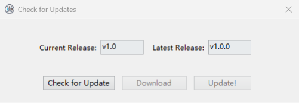
*Figure 18. The update window after a check: current and latest version - captured in Simulation
mode (no hardware attached).*

- Close the main program before upgrading - its program files are locked while it runs.
- Pre-update checklist: stop measurements, close instrument outputs, back up the config and data
  directories, and record the current version for rollback.
- If a release touches drivers, modes or recording, re-validate with simulation and small online
  configs first (section 8).
- Release notes are maintained per version, grouped by features / fixes / internal changes - read
  them before updating.
- Never update mid-experiment; upgrade between experiments and keep the old installer or directory
  for rollback. When rolling back, check data/config compatibility and archive new-version data
  first.

**Config maintenance.** Organize configs by platform / device set / project and give validated
configs stable names; keep test configs in the test directory and production configs in the stable
directory so unvalidated files are not loaded by mistake, and avoid frequent renames. Migrating to
a new computer: copy the config directory, the startup config and the data directory, then verify
the data-directory setting points at a valid location on the new machine. Configs are plain text -
preserve field structure and encoding and re-check in the editor before saving. Back up before
overwriting and always keep the last online-validated version; retire old configs to an archive
directory rather than deleting them. Update configs when addresses, wiring or flows change and note
why. After a software upgrade, confirm existing configs still load; on load errors, check field
naming against the release notes. Archive a copy of the config with each data file.

## 8. Notes & limitations

(source: manual-extraction §9, L971-1038; §10.3, L1088-1100; §7.1; §8.1; conflict registers C3-C7;
reference-manual review, section 7)

### 8.1 The validation ladder

Three validation layers - **simulation → configuration → online** - peel software flow, config and
hardware apart so problems are not co-debugged.

**Simulation validation** runs right after installation: enable simulation, load
`config_time_rng.json`, check startup, mode execution, data-file creation and plotter display. It
covers software flow and recording **only** - connection checks pass by simulation, and no
instrument communication is exercised. The simulation data file has the real format, so
post-processing can be pre-checked, and history viewing can be practiced on simulation data. Turn
simulation off before configuration validation.

**Configuration validation** starts by confirming each channel address against the wiring - wrong
addresses fail at the connection-check stage. Start from the closest sample and modify per-channel;
sample parameter values are starting points, with final values following the real instrument's
response. After each edit: load, observe connections, run one short measurement; adjust one
parameter at a time and log the result. For autorange channels, check first-point stability for
range-switch artifacts. Validate `autorange` / `compliance` / `wait-stable` / `non-block` settings
separately before formal experiments. Keep one validated stable config and copy it for new
experiments instead of overwriting it. Any change to model, address or channel count re-triggers
full config validation.

**Online validation** starts by confirming simulation is OFF, then from low-risk conditions: small
bias with safe compliance for electrical work, short flows for temperature and magnetic work.
Protection parameters are set before the first setpoint write; for sensitive samples, keep
validation conditions far from the operating point. Enable channels one instrument at a time,
watching the config panel so new channels do not disturb validated ones, and fix a failed
instrument before proceeding. Then scale up range, points and device count. Online validation is
complete when data columns match the config outputs, set values and readings share frames, curves
respond to conditions, and the log is clean. Handle anomalies by section 6's staged method and
re-run the affected validation. Finish with one multi-channel joint check and one short full-flow
run before any long measurement, and archive the validation logs and data as the long-term
baseline.

### 8.2 Operational hazards and known limitations

- **Simulation-state hazard** (the single most emphasized): confirm the simulation state before
  every formal measurement. Simulation left on while going online means no instruments are
  connected and the data is simulated.
- **Non-blocking read** is supported through the generic driver path but validated only on the
  2636B; other models must be tested alone first. The voltage and current channels of one SMU
  cannot both enable `non-block`. Compare data files with it on vs off for pacing and dropped
  readings.
- **Date offset:** as reported by the reference manual, the data-directory date computation carries
  a fixed nine-hour offset, so near-midnight measurements may be filed under the neighboring date
  (reported by the reference manual; not verified against the current build).
- **Log window:** the reference manual reports that the log bar keeps only the most recent 64
  entries, older ones overwritten (reported by the reference manual; not verified against the
  current build). Record anomalies promptly.
- **Writable data directory:** data files cannot be created if the data folder is not writable by
  the current user.
- **No hot-unplugging:** never unplug instrument cables while running - stop the measurement and
  close outputs first.
- **No mid-measurement switching:** avoid frequent config or mode changes during a measurement.
  Loading a config stops the measurement first; switching the mode auto-stops the run. To change
  config: stop, confirm saved, reload, re-check connections.
- **After a measurement,** check the data path, the log and the plots before closing.
- **Multi-user platforms:** note the software version and config file name in lab records.
- **Housekeeping:** periodically tidy data directories and logs; retire stale temporary configs.
- **Instrument support claims** in section 3.2 are code-derived; the deltas against the reference
  manual's sample lists (B2900, 2182/2182A, the non-exhaustive mode list, UL200) are annotated
  there.
